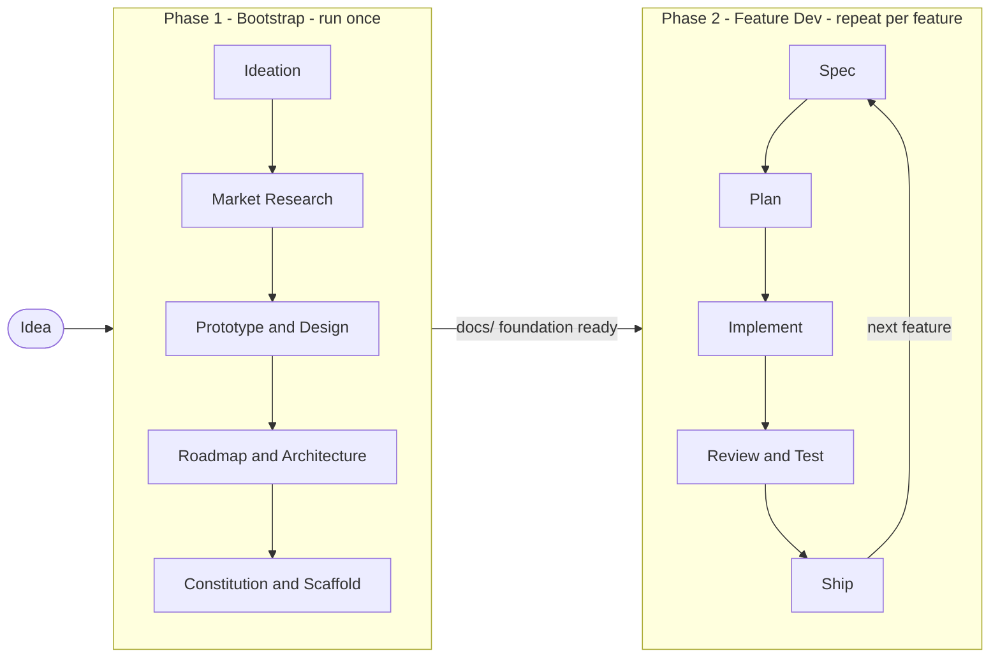

# CraftKit

> AI-agent workflow kit for building software products from idea to shipped features.

[](https://github.com/KhoaLy2003/craft-kit/actions/workflows/test.yml)
[](https://github.com/KhoaLy2003/craft-kit/actions/workflows/lint.yml)
[](https://github.com/KhoaLy2003/craft-kit/blob/main/LICENSE)
[](https://nodejs.org)

CraftKit is a structured workflow kit you share with your AI agent. Describe what you want to build — the agent handles research, design, planning, and implementation while pausing at key decisions so you stay in control.

Works with Claude Code, Cursor, Gemini CLI, and any harness that supports multi-agent dispatch.

**[Full documentation →](https://khoaly2003.github.io/craft-kit)**

---

## Table of Contents

- [How It Works](#how-it-works)
- [Quick Start](#quick-start)
- [Phase 1 — Bootstrap](#phase-1--bootstrap)
- [Phase 2 — Feature Development](#phase-2--feature-development)
- [Existing Projects](#existing-projects)
- [Required Skills & Agents](#required-skills--agents)
- [Kit Contents](#kit-contents)
- [Contributing](#contributing)

---

## How It Works

CraftKit is two phases. Phase 1 runs once to take a raw idea to a working scaffold. Phase 2 repeats for every feature until the product ships.



**Hard gates** — marked steps that require your explicit approval before the agent continues — appear at Market Research, Design, Roadmap, Architecture, Constitution (Phase 1) and Spec, Manual Check (Phase 2). The agent stops and presents a summary; you decide.

---

## Quick Start

**Requirements:** Node.js ≥ 18, an AI agent harness, the skills and agents listed [below](#required-skills--agents).

```bash
# Install into your project folder
npx github:KhoaLy2003/craft-kit

# Update an existing install
npx github:KhoaLy2003/craft-kit --force

# Kit files only, skip setup prompts
npx github:KhoaLy2003/craft-kit --skip-setup
```

This creates a `kit/` directory at your project root. Then:

```
1. Copy kit/templates/phase-1-kickoff.md → docs/phase-1-kickoff.md
2. Fill it in with your idea, target user, and any constraints.
3. Open your AI session and say:
   "Start Phase 1 using docs/phase-1-kickoff.md."
```

---

## Phase 1 — Bootstrap

Eight steps from raw idea to a running scaffold.

| # | Step | Gate |
|---|---|---|
| 1 | Ideation — clarify problem, user, solution hypothesis | — |
| 2 | Market Research — competitor map, reasons it might not work | **Hard** |
| 3 | Prototype — journey map + clickable HTML prototype | — |
| 4 | Product Design — design tokens, components, mock screens | **Hard** |
| 5 | Roadmap — MoSCoW feature list with build order | **Hard** |
| 6 | Architecture — stack selection + architecture document | **Hard** |
| 7 | Constitution — coding principles for every AI agent on the project | **Hard** |
| 8 | Scaffold — folder structure, CI, smoke test | — |

**End state:** a running scaffold at "hello world" level, plus up to seven approved artifacts in `docs/` that Phase 2 reads on every feature.

---

## Phase 2 — Feature Development

Two tracks. The track is chosen at the Step 5 (Roadmap) gate — once feature sizes and complexity are known.

| Track | File | When to use |
|---|---|---|
| **Standard loop** | `phase-2-feature-dev.md` | One feature per cycle, repeated. Best for M/L features, complex codebases, or a growing feature set. |
| **Single-pass** | `phase-2-single-pass.md` | All features in one cycle. Best for small apps: ≤15 Must features, one domain, complete scope known upfront. |

**Start a feature cycle (standard loop):**
```
"Pick the next pending feature from docs/roadmap.md and run the Phase 2 cycle using kit/phase-2-feature-dev.md."
```

**Start single-pass:**
```
"Run Phase 2 single-pass using kit/phase-2-single-pass.md for all Must features in docs/roadmap.md."
```

> **Beta note:** The standard loop step files are complete but not yet end-to-end validated internally. All five test rounds used single-pass. Recommend single-pass for first-time use unless the project clearly requires per-feature cycles.

---

## Existing Projects

Skip Phase 1. Create a `docs/` folder at your project root with these four files — Phase 2 reads them on every feature:

| File | Template | What to put in it |
|---|---|---|
| `docs/constitution.md` | `templates/08-constitution.md` | Coding principles for AI-generated code: naming, types, testing standard, architectural rules. Be specific. |
| `docs/architecture.md` | `templates/07-architecture.md` | Existing stack, folder layout, key architectural decisions. |
| `docs/DESIGN.md` | `templates/05-design-system.md` | Design tokens and component list. Use `resource/DESIGN.md` as a format reference. |
| `docs/roadmap.md` | `templates/06-roadmap.md` | MoSCoW feature list with build order. Phase 2 updates `Status` as features ship. |

Once those files exist, start Phase 2 with the prompt above.

---

## Required Skills & Agents

Install these before starting Phase 1. Missing items surface as errors mid-run — not upfront.

**Skills** (install via your harness's skill manager):

| Skill | Used in |
|---|---|
| `brainstorming` | Phase 2 Step 1 |
| `writing-plans` | Phase 2 Step 2 |
| `subagent-driven-development` | Phase 2 Step 4 |
| `dispatching-parallel-agents` | Phase 2 Step 4 |
| `requesting-code-review` | Phase 2 Step 6 |
| `finishing-a-development-branch` | Phase 2 Step 9 |
| `using-git-worktrees` | Phase 2 Step 4 |
| `verification-before-completion` | Phase 2 Step 5 |
| `design-taste-frontend` | Phase 2 Step 4 (UI work) |

**Agents** (download as `.md` files to your harness's agents folder):

| Agent | Role |
|---|---|
| `market-researcher` | Phase 1 Step 2 — market analysis |
| `research-analyst` | Phase 1 Step 6 — stack research |
| `frontend-developer` | Phase 2 — frontend implementation |
| `code-reviewer` | Phase 2 Step 6 — code review |
| `ui-ux-tester` | Phase 2 Step 7 — browser-driven UI testing |

The installer will prompt you to set these up. Run `npx github:KhoaLy2003/craft-kit` interactively to get guided setup.

---

## Kit Contents

| Path | Purpose |
|---|---|
| `phase-1-bootstrap.md` | Phase 1 orchestration script |
| `phase-2-feature-dev.md` | Phase 2 standard loop orchestration |
| `phase-2-single-pass.md` | Phase 2 single-pass orchestration |
| `phase-bug-fix.md` | Bug fix workflow: Assess → Fix → Verify |
| `steps/phase-1/` | Step detail files `p1-01` through `p1-08` |
| `steps/phase-2/` | Step detail files for standard loop and single-pass |
| `templates/` | Output templates for every Phase 1 artifact |
| `task-agent-rubric.md` | Task type → specialist agent routing table |
| `resource/DESIGN.md` | Airbnb-style design system reference |
| `guides/evolving-specs.md` | How to handle spec changes after a feature ships |

---

## Contributing

Contributions welcome:

- **New templates** — for steps that don't yet have an output template
- **Phase workflows** — alternative workflows for mobile, API-only, etc.
- **Agent rubric entries** — new task type → specialist agent mappings
- **Fixes** — corrections to gate logic, agent assignments, or step outputs

Open a pull request with a description of what changes and why. See [open issues](https://github.com/KhoaLy2003/craft-kit/issues) for existing requests.

---

## License

MIT © [Khoa Ly](https://github.com/KhoaLy2003)
