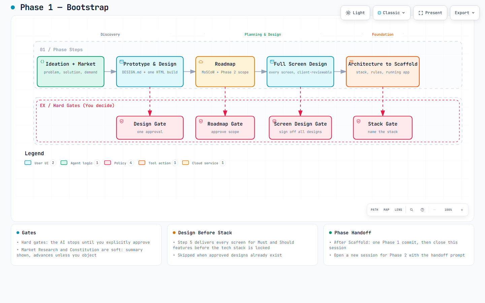
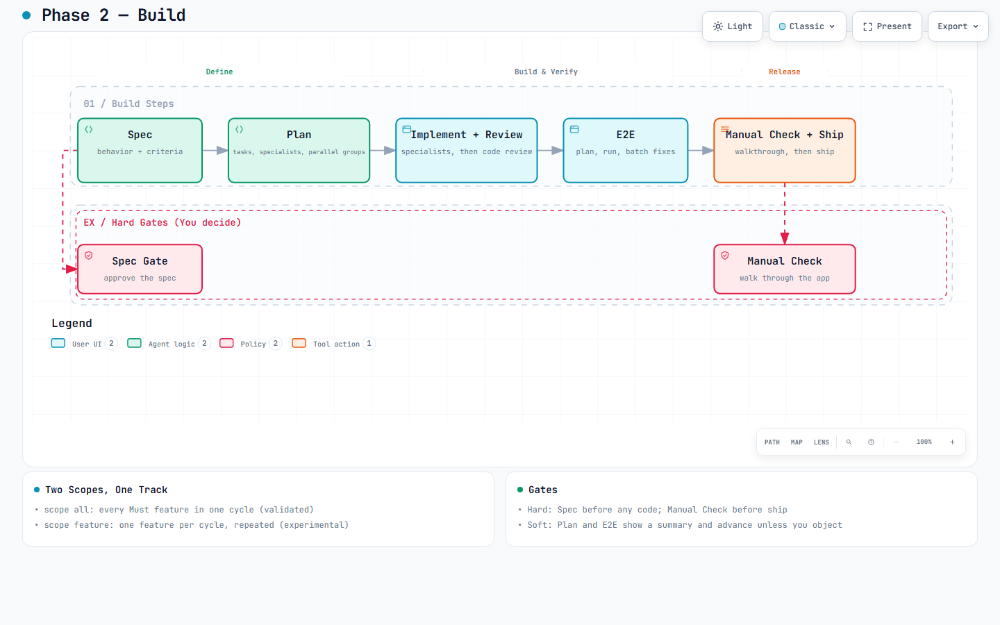

# CraftKit

> AI-agent workflow kit for building software products from idea to shipped features.

[](https://github.com/KhoaLy2003/craft-kit/actions/workflows/test.yml)
[](https://github.com/KhoaLy2003/craft-kit/actions/workflows/lint.yml)
[](https://github.com/KhoaLy2003/craft-kit/blob/main/LICENSE)
[](https://nodejs.org)

CraftKit is a structured workflow kit you share with your AI agent. Describe what you want to build — the agent handles research, design, planning, and implementation while pausing at key decisions so you stay in control.

Works with any AI coding assistant. Phase 1 maps your available models to three capability tiers once (`docs/MODELS.md`); every later step reuses that map.

**[Full documentation →](https://khoaly2003.github.io/craft-kit)**

---

## Table of Contents

- [How It Works](#how-it-works)
- [Quick Start](#quick-start)
- [Phase 1 — Bootstrap](#phase-1--bootstrap)
- [Phase 2 — Build](#phase-2--build)
- [Other Workflows](#other-workflows)
- [Existing Projects](#existing-projects)
- [Required Skills & Agents](#required-skills--agents)
- [Kit Contents](#kit-contents)
- [Contributing](#contributing)

---

## How It Works

Phase 1 runs once and takes a raw idea to a working scaffold. Phase 2 builds the product — all Must features in one cycle, or one feature per cycle.

[](https://khoaly2003.github.io/craft-kit/diagrams/phase-1-bootstrap.html)

[](https://khoaly2003.github.io/craft-kit/diagrams/phase-2.html)

> [Interactive diagrams](https://khoaly2003.github.io/craft-kit/diagrams/) — pan, zoom, search, and export.

**Gates.** `none` advances automatically; `soft` shows a summary and advances unless you object; `hard` stops until you explicitly approve.

---

## Quick Start

**Requirements:** Node.js ≥ 18, an AI agent harness, the skills and agents listed [below](#required-skills--agents).

```bash
# Install into ./kit
npx github:KhoaLy2003/craft-kit

# Update an existing install (also removes kit files dropped since the last install)
npx github:KhoaLy2003/craft-kit --force

# Kit files only, skip setup prompts
npx github:KhoaLy2003/craft-kit --skip-setup
```

Then:

```
1. Copy kit/templates/phase-1-kickoff.md → docs/phase-1-kickoff.md
2. Fill it in with your idea, target user, and any constraints.
3. Open your AI session and say:
   "Start Phase 1 using kit/phase-1-bootstrap.md and docs/phase-1-kickoff.md."
```

---

## Phase 1 — Bootstrap

Eight steps from raw idea to a running scaffold. Orchestration: `kit/phase-1-bootstrap.md`.

| # | Step | Gate |
|---|---|---|
| 1 | Ideation — problem, user, solution hypothesis | none |
| 2 | Market Research — competitor map, reasons it might not work (run/skip chosen in the kickoff form) | soft |
| 3 | Prototype & Design — journey map, `DESIGN.md`, one clickable HTML prototype built with it | **hard** |
| 4 | Roadmap — MoSCoW feature list, build order, Phase 2 scope | **hard** |
| 5 | Full Screen Design — every screen for Must + Should features (skippable when designs exist) | **hard** |
| 6 | Architecture — stack research, analysis, stack decision | **hard** |
| 7 | Constitution — coding rules for every AI agent on the project | soft |
| 8 | Scaffold — folder structure, CI, smoke test, one commit, Phase 2 handoff prompt | none |

**End state:** a running "hello world" scaffold, one commit, and approved artifacts in `docs/` that Phase 2 reads.

---

## Phase 2 — Build

One track, seven steps, run at one of two scopes. The scope is decided at the Phase 1 Roadmap gate — the selection rule lives in `kit/steps/phase-1/p1-04-roadmap.md` and is recorded as `Phase 2 Scope: all | feature` in `docs/roadmap.md`.

| Scope | Unit of work | Best for |
|---|---|---|
| `all` | Every Must feature in one cycle | Small apps: one domain, small/medium features, complete scope known upfront. Validated in five test rounds. |
| `feature` | One feature per cycle, repeated in build order | Larger or multi-domain products. **Experimental** — not yet validated in a test round. |

| # | Step | Gate |
|---|---|---|
| 1 | Spec — behaviour and acceptance criteria | **hard** |
| 2 | Plan — ordered tasks, `Specialist:` per task, parallel groups | soft |
| 3 | Implement — branch `feature/<slug>`, specialist subagents | none |
| 4 | Review — code review plus acceptance-criteria coverage | none |
| 5 | E2E — write the E2E plan, run it, batch failures into one fix pass | soft |
| 6 | Manual Check — you walk through the running app | **hard** |
| 7 | Ship — commit, PR, roadmap updated | none |

Start it:

```
"Run Phase 2 using kit/phase-2.md."
```

---

## Other Workflows

All experimental — not yet validated in a test round.

| Workflow | File | Use when |
|---|---|---|
| Bug Fix | `phase-bug-fix.md` | Something shipped is broken: Assess (hard) → Fix → Verify. Reproduce first; the fix stays inside the assessed scope. |
| Phase 3 — Iterate | `phase-3-iterate.md` | Discover → Prioritise (hard) → Handoff: turn real-world feedback into the next roadmap release. |
| Session Handover | `guides/session-handover.md` | A long run must continue in a fresh session. |

---

## Existing Projects

Skip Phase 1. Create these files in `docs/` — Phase 2 reads them on every cycle:

| File | Template | What to put in it |
|---|---|---|
| `docs/constitution.md` | `templates/07-constitution.md` | Coding principles for AI-generated code: naming, types, testing standard, architectural rules. Be specific. |
| `docs/architecture.md` | `templates/06-architecture.md` | Existing stack, folder layout, key architectural decisions. |
| `docs/DESIGN.md` | `templates/03c-design-system.md` | Design tokens and component list. `guides/design-reference.md` shows the expected format. |
| `docs/roadmap.md` | `templates/04-roadmap.md` | MoSCoW feature list with build order and `Phase 2 Scope`. Phase 2 updates `Status` as features ship. |
| `docs/MODELS.md` | `templates/MODELS.md` | Tier → model map. Run the "Model tiers" section of `phase-1-bootstrap.md` to produce it. |

Then start Phase 2 with the prompt above.

---

## Required Skills & Agents

Install these before starting Phase 1. `npx github:KhoaLy2003/craft-kit` prompts you through setup interactively.

**Skills** — loaded via your harness's skill manager (e.g. Superpowers on Claude Code, Cursor, and others):

| Skill | Used in |
|---|---|
| `brainstorming` | Phase 1 Step 1, Phase 2 Step 1 |
| `writing-plans` | Phase 2 Step 2 |
| `subagent-driven-development` | Phase 2 Step 3 |
| `dispatching-parallel-agents` | Phase 2 Step 3 |
| `using-git-worktrees` | Phase 2 Step 3 |
| `design-taste-frontend` | Phase 2 Step 3 (UI work) |
| `requesting-code-review` | Phase 2 Step 4 |
| `finishing-a-development-branch` | Phase 2 Step 7 |
| `verification-before-completion` | All phases |

> Skills improve consistency, not possibility: without them your AI handles the same work from general capability.

**Agents** (downloaded as `.md` files into `.agents/agents/`):

| Agent | Role |
|---|---|
| `market-researcher` | Phase 1 Step 2 — market analysis |
| `research-analyst` | Phase 1 Step 6 — stack research |
| `frontend-developer` | Phase 1 Step 3, Phase 2 Step 3 — UI work |
| `backend-developer` | Phase 2 Step 3 — API, data, business logic |
| `code-reviewer` | Phase 2 Step 4 — code review |
| `ui-ux-tester` | Phase 2 Step 5 — browser-driven UI testing |

---

## Kit Contents

| Path | Purpose |
|---|---|
| `orchestrator-conventions.md` | Universal rules: step banner, PROJECT_ROOT, write verification, gates |
| `phase-1-bootstrap.md` | Phase 1 orchestration, model tiers, closeout checklist, Phase 2 handoff |
| `phase-2.md` | Phase 2 orchestration (scope `all` / `feature`) |
| `phase-3-iterate.md`, `phase-bug-fix.md` | Other workflows (experimental) |
| `session-logging.md` | Session log format |
| `stack-catalog.md` | Stack baseline and deviation model for the Architecture step |
| `task-agent-rubric.md` | Task type → specialist agent routing |
| `steps/phase-1/`, `steps/phase-2/` | Step detail files `p1-01` … `p1-08`, `p2-01` … `p2-07` |
| `templates/` | Output templates for Phase 1 artifacts, specs, E2E plan, model map |
| `guides/` | `design-reference.md`, `evolving-specs.md`, `interactive-prototype-process.md`, `session-handover.md` |
| `CHANGELOG.md` | Kit change history — kept in this repo, not installed |

---

## Contributing

Contributions welcome — new templates, alternative phase workflows (mobile, API-only), agent rubric entries, and fixes to gate logic or step outputs. Open a pull request describing what changes and why. See [open issues](https://github.com/KhoaLy2003/craft-kit/issues).

---

## License

MIT © [Khoa Ly](https://github.com/KhoaLy2003)
